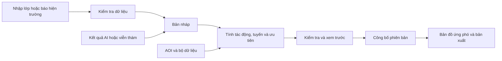

# Tiếp nhận và công bố dữ liệu

Trạng thái: Thiết kế dự kiến, chưa triển khai. Cập nhật: 2026-10-05. Đối chiếu proposal trang 2–3.

Tài liệu này mô tả luồng nhập và công bố trong sản phẩm mở rộng. Công nghệ và thứ tự triển khai ở [kế hoạch backend](../plans/backend.md). Demo SIC hiện dùng dữ liệu chuẩn bị trước, chưa có luồng ghi dùng chung.

## Luồng nghiệp vụ

| Luồng | Người thao tác | Đầu vào | Kết quả |
|---|---|---|---|
| Chọn vùng phân tích | Người trực / chuyên viên | Vẽ polygon hoặc chọn AOI, sự kiện, thời gian và bộ dữ liệu | Bản nháp vùng và yêu cầu phân tích. Báo thiếu dữ liệu nếu vùng vượt phạm vi nguồn |
| Báo ảnh hưởng | Người trực | Chọn điểm/đoạn đường, hiện tượng, thời gian quan sát, nguồn, tình trạng liên lạc hoặc yêu cầu hỗ trợ | Bản ghi mới chờ kiểm tra, có ID và người gửi |
| Nhập lớp dữ liệu | Quản trị dữ liệu / chuyên viên | GeoJSON đường/địa bàn/điểm ứng phó, ảnh/DEM, metadata | Lớp bản nháp và kết quả kiểm tra định dạng, tọa độ, nguồn/ngày |
| Nhập kết quả AI/RS | Chuyên viên / pipeline | Vùng tác động, phạm vi quan sát hợp lệ, phương pháp/version, nguồn ảnh | Kết quả chờ kiểm tra. Chưa tự xác nhận đường bị chặn hoặc khu cô lập |
| Kiểm tra và công bố | Người có quyền duyệt | Lớp/báo cáo/kết quả phân tích, thay đổi so với bản đang công bố | Một phiên bản mới gồm dữ liệu, tuyến, ưu tiên và căn cứ cùng thời điểm |

Vẽ đo là công cụ tạm. AOI là yêu cầu phân tích. Vùng sạt lở/ngập là quan sát hoặc kết quả phân tích. Ba loại hình này không thay thế nhau. Nhập file hoặc gửi báo cáo không tự sửa bản đồ đang công bố.

## Màn hình

| Vị trí | Chức năng |
|---|---|
| Bản đồ ứng phó | Xem bản công bố. Chọn đối tượng để báo ảnh hưởng. Công cụ Chọn vùng tách khỏi Đo |
| Form báo ảnh hưởng | Điền sẵn vị trí/đoạn đang chọn. Các trường nguồn và thời điểm rõ ràng. Gửi xong trả ID và trạng thái |
| Vùng phân tích | Vẽ/chọn AOI, xem nguồn phủ vùng, chọn dữ liệu và gửi yêu cầu. Hiển thị trạng thái xử lý và mở kết quả |
| Quản lý dữ liệu | Theo sự kiện: Lớp dữ liệu, Báo cáo, Kết quả phân tích. Xem lỗi, đối chiếu thay đổi và công bố. Truy cập riêng theo quyền |

Giữ workspace ứng phó làm màn chính. Quản trị không thêm các menu xử lý file lên màn của người trực.

## Cơ chế dữ liệu

| Cơ chế | Yêu cầu |
|---|---|
| Bản nháp | Nhập file và gửi báo cáo không sửa bản đồ đang công bố |
| Đánh giá | Tính từ một bộ đầu vào, lưu version quy tắc và nguồn. Không dùng LLM tạo kết luận ưu tiên |
| Kiểm tra | Lưu người kiểm tra, thời gian, kết quả và lý do |
| Công bố | Ghi dữ liệu, tuyến, ưu tiên và căn cứ trong cùng phiên bản. Từ chối nếu bản nền đã thay đổi |
| Xử lý ảnh | Job có đầu vào/version, trạng thái, kết quả hoặc lỗi. Tác vụ dài chạy ngoài request HTTP |

Các module nghiệp vụ dự kiến: `incidents`, `datasets`, `reports`, `analysis`, `publications`. Định hướng là NestJS/TypeScript; cấu trúc mã và contract v2 hoàn thiện khi bắt đầu triển khai.

| Dữ liệu lưu | Nội dung cần có |
|---|---|
| Incident / AOI | ID, tên, trigger, hình học, người tạo, thời gian |
| Dataset / Layer | Vai trò lớp, nguồn, thời gian thu nhận/quan sát, CRS, footprint, nodata, file/checksum, trạng thái |
| FieldReport | Đối tượng/vị trí, nội dung, thời gian quan sát/nhận tin, nguồn, người gửi, người duyệt |
| AnalysisRun | AOI, version đầu vào, phương pháp/version, trạng thái, kết quả, lỗi |
| Publication | Revision, dữ liệu và kết quả tham chiếu, người công bố, thời điểm, bản trước |

Quyền tối thiểu: người xem đọc bản công bố, người trực gửi báo cáo, chuyên viên kiểm tra/công bố, quản trị quản lý dữ liệu và tài khoản. API kiểm quyền cho mọi thao tác ghi. Một người có thể kiêm nhiều vai trò.

## Hợp đồng tích hợp

API v1 hiện tại chỉ phục vụ kịch bản: một `report`, hai mốc thời gian và cờ `updated` trong frontend. Không dùng cấu trúc này để giả lập lịch sử nhiều báo cáo.

| API v2 dự kiến | Trách nhiệm |
|---|---|
| `POST /incidents` | Tạo sự kiện/AOI bản nháp |
| `POST /incidents/{id}/datasets` | Tiếp nhận file và metadata, trả kết quả kiểm tra hoặc job |
| `POST /incidents/{id}/reports` | Lưu báo cáo, trả ID/trạng thái. Gửi lại cùng khóa yêu cầu không tạo bản trùng |
| `POST /incidents/{id}/reports/{reportId}/reviews` | Ghi người kiểm tra, kết quả chấp nhận/từ chối và lý do. Chưa thay bản công bố |
| `POST /incidents/{id}/analysis-runs` | Tạo yêu cầu phân tích từ AOI và version dữ liệu cụ thể |
| `GET /analysis-runs/{id}` | Tiến độ, kết quả hoặc lỗi. Đợt đầu dùng polling |
| `POST /incidents/{id}/publications` | Duyệt thay đổi và công bố nguyên tử. Từ chối nếu bản nền đã thay đổi |
| `GET /incidents/{id}/workspace?revision=...` | Trả snapshot công bố và manifest tài nguyên của chính revision đó |

Các đường dẫn trên thuộc `/api/v2`, chưa tồn tại trong app. Snapshot v2 tách báo cáo, trạng thái duyệt và bản công bố. Quy tắc/tuyến do server tính, frontend đọc kết quả. Prepared v1 giữ nguyên để demo độc lập. Adapter v2 phải có schema riêng và kiểm tra tương thích, không ghép snapshot mới với manifest tĩnh v0.2.

GeoJSON nhập theo WGS84, chuyển sang CRS phù hợp trước đo/tính tuyến. Kiểm hình học, ID, nguồn, thời gian, footprint và kết nối mạng. Geometry hợp lệ không chứng minh đường thông hoặc ảnh đủ chất lượng. Không sửa trực tiếp dữ liệu đã công bố.

## Kiểm tra hoàn thành

| Tình huống | Kết quả phải có |
|---|---|
| Tải lại trang / khởi động lại server | Báo cáo và bản công bố còn nguyên |
| Hai trình duyệt | Người gửi thấy báo cáo chờ kiểm tra. Người xem chỉ nhận thay đổi sau công bố |
| Tin chưa duyệt hoặc bị từ chối | Không thay trạng thái đường, tuyến hoặc ưu tiên đang công bố |
| Tin đã duyệt | Tạo revision mới. Bản đồ, tuyến, căn cứ và bản xuất cùng revision |
| Hai người công bố từ cùng bản nền | Người sau phải đối chiếu lại thay đổi, không ghi đè im lặng |
| File sai CRS / thiếu nguồn / job lỗi | Nêu lỗi cụ thể, giữ bản công bố trước đó |
| AOI ngoài vùng dữ liệu | Hiển thị phần thiếu, không tạo kết quả cho vùng không có quan sát |

Thứ tự triển khai dự kiến ở [kế hoạch backend](../plans/backend.md). Demo và tiến độ hiện tại ở [SIC](../plans/sic-2026.md) và [công việc](../tasks/sic-2026.md).

Căn cứ kiểm tra: [PostGIS ST_IsValid](https://postgis.net/docs/ST_IsValid.html) cho hình học; [OWASP](https://community.owasp.org/vulnerabilities/Unrestricted_File_Upload) cho file upload.
