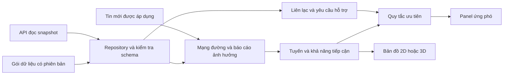

# Kiến trúc hệ thống

Cập nhật: 2026-10-04. Bản hiện hành dùng một sự kiện Chế Tạo với dữ liệu mô phỏng.

## Thành phần đang chạy

| Thành phần | Công nghệ và trách nhiệm | Giới hạn |
|---|---|---|
| Web | Vite, React 18, TypeScript strict, CSS token | App ghép màn hình và trạng thái phiên |
| Bản đồ 2D | Leaflet, SVG và ảnh được chiếu lại trên CPU | Không cần WebGL hoặc GLB. Nền EOX ngoài khu vực cần mạng |
| Bản đồ 3D | Three.js, DEM và GLB tải khi mở 3D | GPU hoặc GLB lỗi thì chuyển về 2D, giữ lựa chọn |
| Dữ liệu | JSON Schema, Ajv, manifest và SHA-256 | Gói Chế Tạo v0.2 là dữ liệu mô phỏng, chưa được duyệt vận hành |
| Đánh giá | Dijkstra trên mạng đường, quy tắc ưu tiên, ước tính di chuyển | Quy tắc thử nghiệm, chưa phải Community Isolation Score |
| Bản xuất | Canvas 2D tạo PNG, JSON lưu snapshot đánh giá | Dùng ảnh cục bộ. Chưa có PDF/GIS export hoặc dữ liệu được duyệt |
| API snapshot | Python standard library, HTTP chỉ đọc | Phục vụ thử tích hợp. Chưa tiếp nhận tin, lưu lịch sử hoặc xử lý ảnh |

Cách chạy tại [README](../../README.md). Quy tắc tính tại [phân tích ứng phó](response-analysis.md), định dạng tại [hợp đồng dữ liệu](data-contract.md).

## Dòng dữ liệu

Gói tĩnh và API dùng cùng hợp đồng. API lỗi không được thay bằng dữ liệu mô phỏng. Tin mới tạo lại các kết quả liên quan từ một snapshot, tránh cập nhật đường nhưng giữ nguyên căn cứ hoặc ưu tiên cũ.

## Ranh giới mã

| Vị trí trong `viewer/src` | Trách nhiệm |
|---|---|
| `App.tsx` | Ghép màn hình, lựa chọn, modal, mô hình địa hình |
| `data/` | Kiểm tra gói, repository prepared/API, adapter cho công cụ địa hình |
| `features/incident/` | Snapshot, quy tắc ưu tiên và thời điểm nguồn |
| `features/routes/` | Tính tuyến, ước tính di chuyển, mặt cắt |
| `features/map/` | Bản đồ Leaflet, ảnh 2D, fallback 3D |
| `features/search/` | Chỉ mục tên/mã, chuẩn hóa tiếng Việt và hộp tìm trên bản đồ |
| `features/measurement/` | Đo khoảng cách/diện tích UTM, hình đo tạm và thao tác operator trên Leaflet |
| `features/briefing/` | Snapshot đánh giá, xem trước, dựng PNG và tải PNG/JSON |
| `terrain/` | Tọa độ, lấy mẫu DEM, lớp Three.js, ký hiệu và bố trí nhãn |
| `components/dear/` | Panel, hộp thoại và điều khiển nhận dữ liệu qua props |
| `shared/` | Thành phần và hành vi dùng ở nhiều màn |

Renderer không quyết định ưu tiên. Component không giữ một bản báo cáo riêng. `cheTaoScenario.ts` chỉ còn adapter đọc JSON cho các công cụ và kiểm thử cũ. Phần quản lý upload và vòng đời Three.js còn cần tách tiếp khi mở rộng.

## Pipeline theo proposal

| Bước proposal | Hiện tại | Phần cần tích hợp |
|---|---|---|
| Theo dõi và trigger | Mốc và thông báo trong gói mô phỏng | GPM, ngưỡng trigger, feed sự kiện |
| Thu nhận, tiền xử lý ảnh | Có dữ liệu nền địa hình và ảnh | SAR trước/sau, căn chỉnh, vùng quan sát hợp lệ |
| Nhận diện sạt lở | Các điểm đã chuẩn bị | Mô hình AI, chất lượng và kiểm chứng |
| Đánh giá tiếp cận | Tính trên mạng đường mẫu và báo cáo | Mạng đường đủ vùng, điều kiện phương tiện, chính sách nghiệp vụ |
| Bản đồ ưu tiên | Có luồng địa bàn, tuyến, căn cứ và xuất PNG/JSON | Dữ liệu được RS/PO duyệt, thử bản xuất trên máy trình chiếu |

Sau SIC, triển khai FastAPI, PostgreSQL/PostGIS, kho ảnh/tile và worker Python khi cần nhận dữ liệu, xử lý ảnh, duyệt công bố hoặc nhiều người dùng. Worker tạo kết quả phân tích, API công bố snapshot, web trình bày và kiểm tra phương án. LLM không nằm trong đường tính ưu tiên hiện tại.
