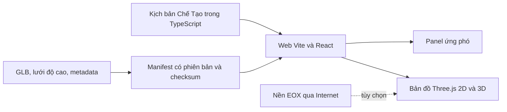

# Kiến trúc hệ thống

Cập nhật: 2026-10-02. Phân biệt bản đang chạy và kiến trúc cần hoàn thiện trước SIC.

## Hiện trạng



| Phần | Đang chạy | Giới hạn |
|---|---|---|
| Frontend | Vite, React 18, TypeScript strict, CSS token; build tĩnh bằng npm | Chưa tách dữ liệu sự kiện khỏi mã ứng dụng |
| Bản đồ | Three.js dùng chung mô hình địa hình cho góc nhìn 2D/3D; lớp đường, điểm sạt lở, địa bàn và tuyến | 2D vẫn cần WebGL. Nền EOX cần mạng; chưa có bản đồ 2D độc lập khi GPU lỗi |
| Dữ liệu | Kịch bản nghiệp vụ trong `cheTaoScenario.ts`; manifest v0.1 trỏ đến GLB, grid và metadata; công cụ kiểm tra checksum | Chưa có schema/gói nghiệp vụ tách khỏi mã hoặc dữ liệu sự kiện thực đã duyệt |
| Tích hợp | Không có API hay backend của DEAR; chỉ tải tài sản tĩnh và nền EOX | Bản tin U-1 được kích hoạt trong trình duyệt, không phải feed hiện trường |
| Kiểm tra | TypeScript, Vitest, kiểm tra gói dữ liệu và thử build khi chặn Internet | Chưa nghiệm thu dữ liệu, 2D độc lập WebGL, phiên dài hoặc bản xuất |

`npm run dev`, `npm test`, `npm run typecheck` và `npm run build` tự chạy bước chuẩn bị dữ liệu. Công cụ kiểm tra file chuẩn trong `DEM_to_3D/` rồi chép vào `public/terrain/` khi thiếu hoặc khác checksum; chỉ các bản nguồn cần có trong Git. Hướng dẫn chạy nằm ở [README](../../README.md).

Tài liệu tháng 9 mô tả Next.js, Cesium, Leaflet, Zustand và pnpm như lựa chọn **dự kiến**; chúng chưa có trong web hiện tại. Giữ Vite/React/Three.js đến SIC để không làm lại phần đang chạy. Vite tạo được gói tĩnh từ `npm run build` theo [tài liệu chính thức](https://vite.dev/guide/build).

## Đường tới bản SIC

Trước 20/10, backend **không nằm trên đường chạy bắt buộc**. Web đọc một bộ dữ liệu đã chuẩn bị, có phiên bản và được kiểm tra trước khi công bố. Việc cần làm theo thứ tự:

1. Mở rộng manifest địa hình hiện có thành gói có schema thực thi cho Incident, Community, Road, Hazard, Route, Evidence, nguồn và quyền dùng; kiểm tra ID, CRS, thời gian, trạng thái thiếu dữ liệu và checksum. Dùng [đặc tả dữ liệu](data-contract.md) làm đầu vào.
2. Chuyển kịch bản cố định sang gói dữ liệu có phiên bản và một `ScenarioRepository` đọc gói đó. Component chỉ nhận dữ liệu/ID và callback; không nhập trực tiếp `cheTaoScenario.ts`.
3. Hoàn thành bản đồ 2D chạy độc lập với WebGL nếu vẫn giữ tiêu chí P0/A09. Leaflet với tile/GeoJSON là một phương án; [Leaflet hỗ trợ GeoJSON](https://leafletjs.com/examples/geojson/) và lớp ảnh/tile. Thử trên máy demo trước khi chốt.
4. Ghép ảnh, bằng chứng và hai tuyến đã được RS/PO duyệt; kiểm tra luồng sáu phút, bản xuất và chạy mất mạng. Nếu dữ liệu chưa đủ, ghi rõ phần rút gọn theo [kế hoạch](../plans/sic-2026.md).

Không gọi kịch bản cố định là “API tích hợp” hoặc dùng nền tham chiếu cũ như ảnh sau sự kiện. Nút bật bản tin U-1 chỉ phục vụ diễn tập.

## Ranh giới frontend

Tổ chức dần trong `DEM_to_3D/viewer/src`; không di chuyển toàn bộ file một lần:

```text
app/                 ghép màn hình, điều hướng, modal và trạng thái phiên
features/incident/   tình huống và diễn biến
features/impact/     đường, vùng ảnh hưởng và trạng thái
features/communities/ ưu tiên địa bàn
features/routes/     tuyến và phân tích mặt cắt
features/evidence/   nguồn, ảnh và mức xác minh
features/map/        adapter bản đồ, lớp, marker và điều khiển
data/                ScenarioRepository, prepared/API adapters
shared/              token và thành phần thực sự dùng ở nhiều feature
```

`App` chỉ ghép các feature và giữ lựa chọn của phiên. Phép tính độ cao/tuyến nằm ngoài JSX; renderer không chứa quy tắc ưu tiên cứu hộ. Không thêm một thư mục `components` chung cho mọi thứ. CSS token giữ toàn cục, kiểu riêng để cạnh feature hoặc đặt tên có phạm vi rõ. Bước đầu đã tách `useRouteTerrainAnalysis` khỏi `App`; tiếp theo tách quản lý mô hình và nguồn kịch bản, sau đó chia `TerrainViewer` theo vòng đời scene, camera, nền và lớp nghiệp vụ. Mỗi bước phải giữ nguyên luồng browser trước khi chuyển bước tiếp.

## Sau SIC: khi cần backend

Thêm backend khi cần nhận dữ liệu mới, nhiều sự kiện/người dùng, duyệt công bố, lịch sử cập nhật hoặc quyền truy cập. Đề xuất: FastAPI cho API và schema OpenAPI, PostgreSQL/PostGIS cho dữ liệu không gian, kho file cho ảnh/tile/DEM và worker Python cho xử lý viễn thám. [FastAPI](https://fastapi.tiangolo.com/tutorial/response-model/) hỗ trợ response model/OpenAPI; [PostGIS](https://postgis.net/docs/ST_Intersects.html) hỗ trợ truy vấn giao cắt không gian. Đây là **đích sau SIC**, chưa phải thành phần đã triển khai.

API trả về cùng hợp đồng dữ liệu đã dùng cho gói tĩnh, gồm `datasetVersion`, `observedAt`, `publishedAt`, trạng thái xác minh và tham chiếu bằng chứng. Trình duyệt chỉ đọc bản dữ liệu đã công bố; xử lý ảnh và duyệt kết quả nằm ngoài request xem bản đồ. Không đặt thuật toán phân tích nặng trong API đồng bộ.
