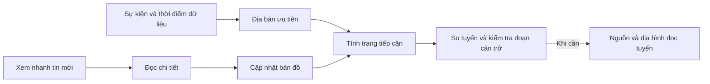

# Thiết kế giao diện

Cập nhật: 2026-10-02. Áp dụng cho web React tại `DEM_to_3D/viewer`.

## Luồng ứng phó

Luồng này phục vụ bước phân tích và bản đồ hỗ trợ quyết định trong proposal. Các giai đoạn xử lý ảnh không trở thành menu bắt buộc của người trực.

## Màn hình và thông tin

| Vị trí | Thông tin chính | Mở khi cần |
|---|---|---|
| Sự kiện | Sự kiện, giờ kích hoạt, dữ liệu đến, địa bàn ưu tiên, số đoạn bị chặn/chưa rõ | Diễn biến phân tích, nguồn dữ liệu |
| Chi tiết địa bàn | Lý do ưu tiên, tiếp cận, phương án và việc cần xử lý | Tuyến, căn cứ, dân số tham chiếu |
| Tuyến | Phương án, khoảng cách, tình trạng từng đoạn | Địa hình dọc tuyến, nguồn của đoạn đường |
| Đường sá | Tên, trạng thái, chiều dài. Đoạn bị chặn xếp trước | Ghi nhận, việc cần xử lý, bản ghi nguồn |
| Bản đồ | AOI, nền, mạng đường, tình trạng đường, điểm ảnh hưởng, địa bàn, điểm tập kết | Lớp trên trái, chú giải dưới trái, nguồn sau nút thông tin |
| Chuông thông báo | Hộp xem nhanh tin mới | Chi tiết tin, cập nhật bản đồ |
| Cài đặt | Ngôn ngữ, sáng/tối, font | Quản lý mô hình địa hình |

Panel bên trái, điều chỉnh độ rộng bằng đường phân cách. Bản đồ dùng hết phần còn lại. Ba tab **Sự kiện / Đường sá / Địa bàn** nằm trên panel. Mobile chuyển giữa **Thông tin** và **Bản đồ**.

## Hành vi

| Thao tác | Kết quả |
|---|---|
| Chọn địa bàn mới | Mở chi tiết và tuyến mặc định của địa bàn |
| Bấm lại địa bàn đang xem | Giữ tab và tuyến đã chọn |
| Chọn đoạn đường hoặc điểm ảnh hưởng | Thay nội dung trong cùng panel. Đưa điểm vào vùng nhìn nếu đang ngoài màn hình hoặc sau điều khiển |
| Đóng chi tiết | Trở về nơi mở chi tiết, giữ tìm kiếm, bộ lọc và vị trí cuộn |
| Đọc tin hoặc xem đoạn đường từ tin | Không đổi dữ liệu bản đồ |
| Cập nhật bản đồ | Áp dụng tin và cập nhật đánh giá tiếp cận |
| Mở Lớp bản đồ | Đóng mặt cắt, tạm ẩn chú giải. Click ngoài hoặc Escape đóng lớp |
| Đổi tuyến khi mở mặt cắt | Lấy mẫu tuyến mới, đặt vị trí đọc về đầu tuyến |
| Nhiều điểm quá gần nhau | Gộp thành ký hiệu số. Bấm để chọn đối tượng, không bỏ mất điểm |
| GLB hoặc GPU lỗi | Chuyển về 2D, giữ lựa chọn. 2D không tải mô hình GLB |

Không có nút điều động, giao nhiệm vụ hay xác nhận cứu hộ khi chưa có quy trình và dữ liệu tương ứng. Dữ liệu mô phỏng được ghi trong **Nguồn dữ liệu**, không gắn nhãn cuộc thi lên màn thao tác.

Quy tắc tính ưu tiên và tuyến: [phân tích ứng phó](../architecture/response-analysis.md). Thành phần: [design system](design-system.md). Ký hiệu và mặt cắt: [hiển thị bản đồ](cartography.md). Luồng trình diễn: [demo](../operations/demo.md).
