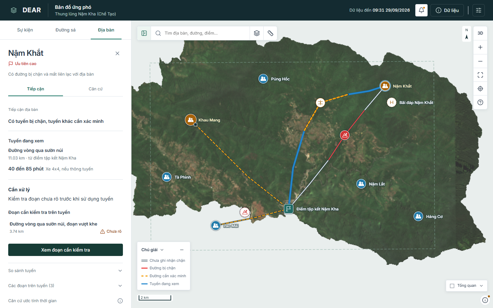
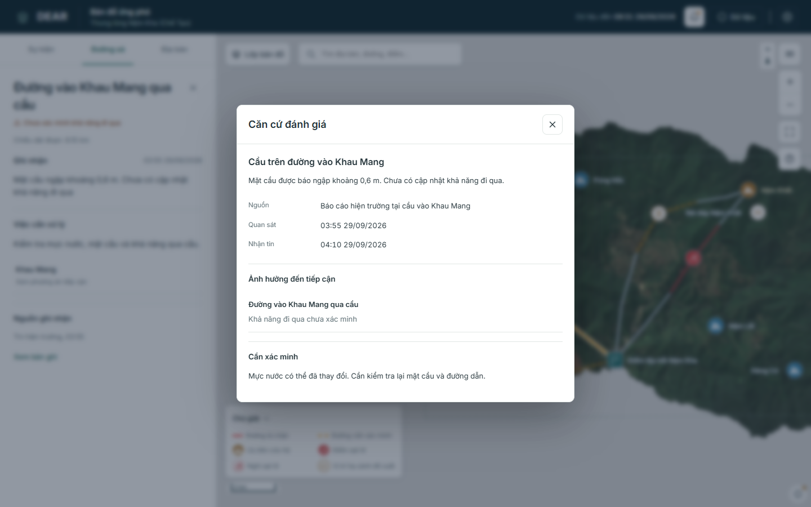

# Rà soát giao diện và luồng ứng phó

Cập nhật: 2026-10-05. Phạm vi: web React, gói Chế Tạo v0.2 và API snapshot cục bộ. Chưa thử với người trực thực tế.

## Kết quả nghiệp vụ

| Người dùng cần biết | Đã có | Cần bổ sung |
|---|---|---|
| Sự kiện và phạm vi đánh giá | Trigger, snapshot, AOI và số địa bàn trong vùng | AOI và nguồn sự kiện được duyệt |
| Địa bàn cần ưu tiên | Quy tắc từ ảnh hưởng, liên lạc, nhu cầu khẩn cấp. Có lý do và việc cần xử lý | Duyệt chính sách, Community Isolation Score |
| Đường cản trở tiếp cận | Trạng thái đoạn, bản ghi nguồn, giờ quan sát và nhận tin | Bằng chứng gốc, kiểm tra hiện trường |
| Phương án tiếp cận | Dijkstra trên mạng đường, khoảng cách, ETA có điều kiện | Mạng đường đủ vùng, tốc độ và phương tiện được kiểm chứng |
| Tin mới thay đổi gì | Đọc không đổi dữ liệu. Áp dụng tin tạo lại đường, tuyến và ưu tiên. Có lịch sử tin và xem bản dữ liệu cũ | Feed, duyệt công bố, lưu lịch sử trên server |
| Địa hình dọc tuyến | Mặt cắt theo hình tuyến, vị trí nối bản đồ, độ dốc DEM, khoảng thiếu | Nguồn DEM, vertical datum, kiểm chứng độ cao |
| Ký hiệu theo proposal | Địa bàn, đường, điểm ảnh hưởng, tập kết, H đề xuất | Polygon sạt lở/ngập, xác nhận đi được hoặc cô lập |
| Chia sẻ nhận định | Xem trước, PNG, in/lưu PDF, JSON và GeoJSON cùng snapshot | Duyệt dữ liệu/nguồn, thử trên máy trình chiếu |
| So ảnh trước/sau | Đọc GeoTIFF hiển thị, kiểm ngày/nguồn/CRS/vùng chung, so bằng thanh trượt | Cặp ảnh RS duyệt, mask mây và chất lượng phân tích |

Ưu tiên cứu hộ không đồng nghĩa cô lập. Chưa ghi nhận chặn không đồng nghĩa đã xác nhận đi được. H là vị trí mô phỏng chưa khảo sát. Quy tắc và giả định ở [phân tích ứng phó](../architecture/response-analysis.md).

## Thiết kế hiện hành

| Thành phần | Cách tổ chức |
|---|---|
| Panel | Cố định bên trái, dùng toàn bộ chiều cao, rộng 320–560 px tùy diện tích màn hình. Chi tiết đóng về ngữ cảnh đã mở |
| Địa bàn | Tiếp cận, Tuyến, Căn cứ. Màn chính giữ trạng thái, phương án, thời gian có điều kiện và việc cần xử lý |
| Đoạn đường | Tình trạng, chiều dài, quan sát, việc cần kiểm tra và địa bàn liên quan. Bỏ phần tham chiếu chỉ có mã |
| Nguồn | Nhận định, nguồn, giờ quan sát/nhận tin, ảnh hưởng và giới hạn. Đoạn liên quan mở được từ bản ghi |
| Bản đồ | 2D mặc định, 3D tải khi cần. Nhóm cùng loại mới có số đếm trên 2D. Nhóm khác loại/3D mở chọn đối tượng. Nhãn tránh chồng, chú giải tách lớp. 2D chỉ Bắc thật, 3D chỉ Bắc lưới |
| Công cụ đo | Khoảng cách/diện tích/chu vi UTM trên 2D. Sửa điểm, giữ kết quả khi kết thúc, đóng hoặc đo lại. Không tạo dữ liệu nghiệp vụ |
| Attribution | Nút thông tin mở nguồn và giấy phép. Giữ dòng credit tối thiểu khi dùng nền ngoài |
| Tìm kiếm | Tên/mã hoặc tiếng Việt không dấu, chọn kết quả bằng bàn phím, mở chi tiết và đưa vào vùng nhìn |
| Bản xuất | Snapshot được sao chép khi mở xem trước. PNG không phụ thuộc GPU hoặc Internet |

[Xem bản xuất PNG](assets/decision-map.png). Ảnh có cùng tuyến, thời điểm và nhận định với bản xem trước trong ứng dụng.

[Công cụ đo bản đồ](assets/workspace-measurement.png). Hình đo tạm giữ lớp tình huống để người trực đối chiếu.

[Lịch sử tin trong sự kiện](assets/workspace-notifications.png). Mở từng tin để đọc quan sát, nguồn, thời gian và hành động liên quan.

Ảnh từ bản build khi chặn Internet. Khoảng trống ngoài ảnh địa hình là vùng thiếu nền cục bộ, không phải vùng đã xác nhận không có thiên tai.

## Kiểm tra kỹ thuật

| Kiểm tra | Kết quả |
|---|---|
| TypeScript và build | Đạt. JavaScript đầu vào khoảng 756 KB, 239 KB gzip; giảm từ 1,32 MB. 2D không tải Three.js/GLB. Vẫn có cảnh báo chunk lớn hơn 500 KB |
| TypeScript unit tests | 118 kiểm thử đạt, gồm phép đo, nhóm điểm, snapshot, quy tắc tuyến/ưu tiên, bản dữ liệu, so ảnh, GeoJSON và timeout/hủy tải cả connection/body |
| Python | 8 kiểm thử dữ liệu, 3 API và 2 đóng gói đạt |
| Chrome: prepared và API | Sự kiện, AOI, địa bàn, tuyến, nguồn, đọc/áp dụng tin và mặt cắt đạt |
| Chrome: lỗi dữ liệu và GPU | Chặn Internet, lỗi GLB, không có WebGL, mất context 3D: 2D tiếp tục dùng được. API lỗi không hiện dữ liệu mô phỏng thay thế |
| Chrome: thao tác và bố cục | Kéo/đổi độ rộng bằng bàn phím, khôi phục độ rộng, nhóm điểm, nhãn. Desktop 1440/1366/1024 px và mobile 390/320 px không tràn ngang |
| Chrome: tìm kiếm và bản xuất | Tìm không dấu và mã đường, xem trước, tải PNG/JSON, thời điểm và tuyến khớp trước/sau tin mới |
| Chrome: công cụ và biến thể | Đo đường/diện tích, sửa điểm, đóng/mở lại, chuyển từ 3D sang 2D. Đổi tối/Anh/font giữ phép đo, Escape đóng hộp đang tương tác |
| Chrome: công cụ phụ | Thông báo, xem dữ liệu cũ/về bản mới, độ rõ/lọc/nhãn, so GeoTIFF có tọa độ, mở lại cặp ảnh, GeoJSON, bản in và đặt lại phiên |
| Chrome: static delivery | Luồng chính và công cụ phụ đạt qua server tĩnh, không cần API. Lỗi CRS khi so ảnh cho phép chọn lại và thử tiếp |
| Source dùng khi deploy | Import kiểm đúng chữ hoa/thường. Thư mục sạch với file được Git theo dõi chuẩn bị đủ dữ liệu, kiểm checksum đạt |
| Dependency audit | Đã vá `fast-uri` lên 3.1.8. `npm audit --omit=dev`: 0 cảnh báo. Audit toàn bộ còn 4 cảnh báo ở Vite/esbuild/Vitest/vite-node |
| Chrome: gói offline | Kiểm checksum, giải nén vào thư mục mới, khởi động prepared, không gọi Internet, áp dụng tin, xuất PNG, 3D/2D và đặt lại |

Kiểm tra trình duyệt: `scripts/check_workspace.py`, `check_map_tools.py`, `check_secondary_tools.py` và `check_offline_package.py`. Cần Python Playwright và Chromium hoặc `--chrome` trỏ đến Chrome đã cài. So ảnh được thử bằng GeoTIFF RGB có tọa độ do script tạo, không phải ảnh thiên tai thực.

Review ngày 2026-10-05 sửa timeout/hủy tải manifest, cấu hình, metadata, grid và GLB; dừng ảnh còn lại khi cặp so ảnh lỗi; giữ đủ thời gian hiển thị thông báo mới. Cấu hình và [hướng dẫn Vercel](../operations/vercel.md) đã có. Kiểm tra tại máy Windows dùng Node 25.8.1/Python 3.12.4; Vercel được cấu hình Node 22.x, chưa chạy build trên Vercel.

Nâng Vite/Vitest lên bản đã vá chưa hoàn tất: proxy trả `403 MediaTypeBlocked` cho binary esbuild 0.28.2 và 0.27.7. Repo giữ bộ build/test cũ đã kiểm tra, không bỏ xác minh TLS. Các advisory còn lại liên quan máy chủ dev/test, không phải máy chủ file tĩnh của Vercel. Cần hoàn tất nâng công cụ ở môi trường tải được binary và chạy lại các kiểm tra trước khi dùng máy chủ dev/test chung.

Chưa tích hợp pipeline vệ tinh, cặp ảnh trước/sau đã duyệt hoặc backend vận hành. Chưa nghiệm thu dữ liệu, đo mục tiêu 3–6 giờ hay độ ổn định phiên dài. PDF dùng bản in của trình duyệt, chưa kiểm tra máy in thật. Tiến độ ở [công việc SIC](../tasks/sic-2026.md), cách chạy tại [gói offline](../operations/offline.md).
