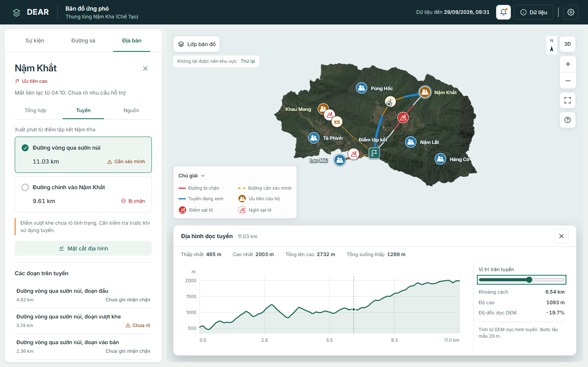

# Rà soát giao diện và luồng ứng phó

Cập nhật: 2026-10-02. Phạm vi: web React và bộ dữ liệu Chế Tạo. Kiểm tra mã và trình duyệt, chưa có thử nghiệm với người trực thực tế.

## Kết quả theo nghiệp vụ

| Câu hỏi của người dùng | Hiện tại | Còn thiếu |
|---|---|---|
| Chuyện gì xảy ra, dữ liệu đến lúc nào? | Sự kiện, giờ kích hoạt, giờ tổng hợp, đường bị chặn/chưa rõ | Nguồn sự kiện trực tiếp và ranh giới AOI |
| Ưu tiên địa bàn nào? | Danh sách ưu tiên, lý do ngắn, tình trạng tiếp cận | RS/PO duyệt tên, tọa độ và căn cứ |
| Đường nào cản trở tiếp cận? | Trạng thái từng đoạn, điểm ảnh hưởng, giờ báo cáo | Bằng chứng gốc và kiểm tra hiện trường |
| Có phương án nào khác? | Hai hình tuyến Nậm Khắt, khoảng cách, đoạn cần xác minh | Tính tuyến từ mạng đường, điều kiện phương tiện và ETA |
| Tin mới thay đổi gì? | Xem nhanh, chi tiết, áp dụng có chủ đích. Không đổi dữ liệu khi chỉ đọc | Feed và quy trình duyệt cập nhật |
| Địa hình dọc tuyến thế nào? | Biểu đồ có trục, vị trí đọc nối bản đồ, độ dốc DEM, giữ khoảng thiếu | Nguồn DEM, vertical datum và kiểm chứng độ cao |
| Đủ yếu tố bản đồ proposal chưa? | Có nền, đường, địa bàn, ưu tiên, điểm ảnh hưởng và tuyến | Polygon sạt lở/ngập, xác nhận đi được, cô lập, HLZ |

Đối chiếu từng ký hiệu và điều kiện dữ liệu: [hiển thị bản đồ](../product/cartography.md). Không coi cộng đồng ưu tiên là cộng đồng cô lập, hay chưa ghi nhận chặn là đã xác nhận đi được.

## Giao diện hiện hành

| Nhóm | Quyết định |
|---|---|
| Panel | Một vị trí cố định. Chi tiết thay nội dung, X trở về ngữ cảnh mở. Giữ tìm kiếm, tab và tuyến |
| Mật độ | Tổng hợp giữ tiếp cận, phương án, khoảng cách và cản trở. Dân số ở Nguồn, mã ở phần tham chiếu |
| Bản đồ | Lớp riêng ở góc trên trái, chú giải phía dưới. Hướng Bắc lưới, thước 2D theo zoom. Nhãn tránh chồng và ưu tiên đối tượng đang chọn |
| Mặt cắt | Lấy mẫu dọc hình tuyến. Khoảng cách panel và biểu đồ cùng nguồn. Không nối qua nodata hoặc vẽ đường xanh che cảnh báo |
| Popup | Hộp xem nhanh không khóa bản đồ. Nguồn chỉ giữ nhận định, loại căn cứ, thời điểm và trạng thái tài liệu gốc |
| Mobile | Bản đồ và mặt cắt có diện tích riêng. Nội dung mặt cắt cuộn, chú giải đầy đủ mở khi cần |

Ảnh từ bản build khi chặn Internet. DEM và dữ liệu sự kiện vẫn dùng được. Khoảng trống quanh DEM không phải phạm vi đã xác nhận không có thiên tai.

## Kiểm tra kỹ thuật

| Kiểm tra | Kết quả |
|---|---|
| TypeScript, build | Đạt. Build còn cảnh báo gói JavaScript lớn |
| Kiểm thử tự động | 68 kiểm thử đạt, gồm hình tuyến, khoảng thiếu DEM, độ dốc, chiều dài và thước tỷ lệ |
| Chrome: luồng ứng phó | Chọn địa bàn, so tuyến, mở nguồn, tin mới, giữ ngữ cảnh, cập nhật trạng thái đạt |
| Chrome: bản đồ và mặt cắt | Zoom đổi thước, 3D ẩn thước phẳng, đọc bằng chuột/bàn phím, thiếu DEM giữ trống đạt |
| Chrome: bố cục | Desktop 1440/1366/1024 px, mobile 390/320 px. Không tràn ngang, lớp cuộn riêng |
| Mô hình khác CRS | Không ghép sai lớp sự kiện hay mặt cắt. Hộp dữ liệu ghi CRS thực |
| Mất mạng | Luồng chính vẫn chạy với DEM và dữ liệu cục bộ. Đây không phải thử GPU/WebGL lỗi |

Backend, ảnh trước/sau, bản xuất và 2D độc lập WebGL chưa có. Chưa nghiệm thu dữ liệu, chưa đo mục tiêu 3–6 giờ hoặc phiên chạy dài.

Việc còn lại theo [danh sách công việc](../tasks/sic-2026.md). Luồng trình diễn theo [demo](../operations/demo.md), xác nhận bàn giao theo [tiêu chí nghiệm thu](acceptance.md).
